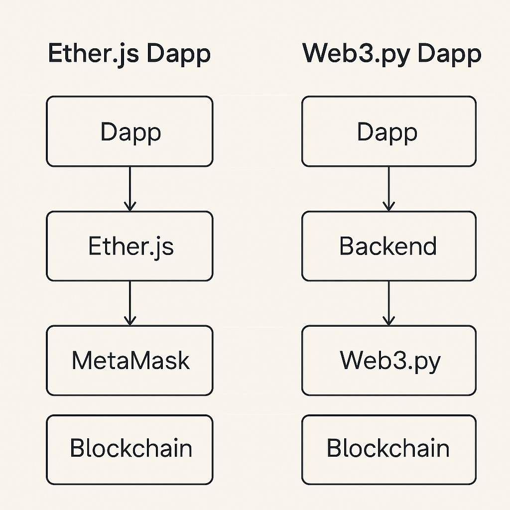

## Web3.py Dapp Architecture




## Requirements

running using Python 3.13

```
python3 -m venv coti-envsource 
coti-env/bin/activate
pip install -r requirements.txt
```

run onboarding example

```
cd coti-python-examples/coti-web3/examples   
python onboard.py

Creation done!
PK
ADDRESS
RuntimeError: Account balance is 0 so user cannot be onboarded.

https://faucet.coti.io
testnet address

python onboard.py
enter PK this time

.coti-python-examples/coti-python-examples/coti-web3/.env is updated with
ACCOUNT_PRIVATE_KEY=
ACCOUNT_ENCRYPTION_KEY=
```

list tokens

```
gemini 2.5 @coti-python-examples @coti-web3

create a program in web3.py  python that list all the COTI  tokens stored  
at this address 0xfAF7e0962B79675cd046C4c0bF41beEb27FCc5C8 on Coti.Testnet
```

```
now do the same thing for COTI  testnet
```

deploy smart contracts

```
requires solc compiler
https://docs.soliditylang.org/en/latest/installing-solidity.html

gemini 2.5 @coti-python-examples @coti-web3 @PrivateStorage.sol

using examaples from @coti-python-examples write a @coti-web3.py program to compile 
and deploy @PrivateStorage.sol on Coti Testnet

[will probably  fail signing]

python3.13 compile_and_deploy_private_storage.py
```

check smart contract on testnet

```
https://testnet.cotiscan.io/address/0xb44E90707A29890942AE1D6595D6A52BA2Ba762e
```

create a web3.py client

```
DONT CHANGE SC ADDRESS FOR TEST
@gemni
given some examples @coti-python-examples @coti-web3.py , the smartcontracts @PrivateStorage.abi   deployed on Coti Testnet 
at 0x5220aa2B4FeC347F751AaE0930d784f5139C526E
create a @coti-web3.py  program with 2 separate functions and a menu 
invoke setPrivateNumber and getPrivateNumber from @PrivateStorage.abi 
use   ACCOUNT_PRIVATE_KEY = "3b8ad7ca3cf54b1273004775afa88587b8d6bd8a970c84fe216f6febb477347d"
AES_KEY = "63f49d1ef7b1510060edcec934828b09" COTI_TESTNET_RPC_URL = "https://testnet.coti.io/rpc"
 
note that set private number should decript a decrypt ctUint64 type```

```

create API

@gemini

```
import code as necessary and create on a new file a Flask api that exposes
POST set\_private\_number\_func(value\_to\_set: int):
GET get\_private\_number\_func():

```

check http://127.0.0.1:5000/privatenumber AND POSTMAN

expose through an NFT
